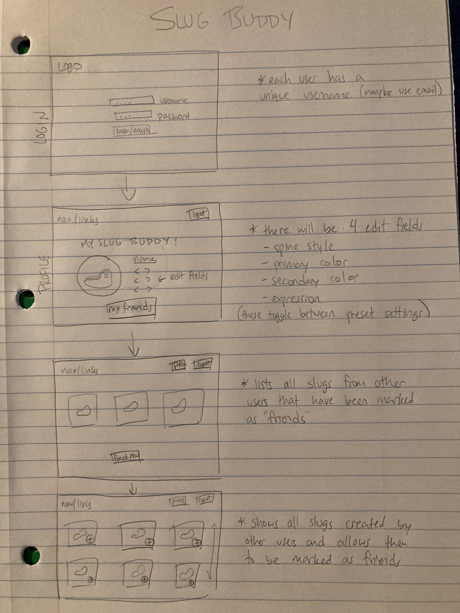

# Slug Buddies
## Elevator Pitch
Have you ever wanted a pet, but your apartment said no? Have you ever had a pet and wished that it could have some friends? A Slug Buddy is the answer! This is an interactive web application that allows you to name and customize your very own pet slug from a robust set of options. Once your slug is created, go out and get your buddies to create their own slugs and add them to your slug's group of friends. Nothing hypes up a party like creating slug buddies!
## Design

### Key Features
- Secure login over HTTPS
- Real-time customization of the slug
- View slugs created by other users
- Slugs and friends are stored between logins
## Deliverables
### HTML
- [ ] 4 HTML pages
- [ ] Links between the pages
- [ ] Form submission for login and naming
- [ ] Images included for the slug
### CSS
- [ ] Consistent page font/color scheme
- [ ] Image styling for the slug
- [ ] Responsive to alternate sizing (mobile/laptop)
### JavaScript
- [ ] Navigation between pages using buttons
- [ ] Database keeps all slugs updated
### Service
- [ ] HTTP service to host frontend
- [ ] Call to third party endpoints (images)
- [ ] Access backend data
### DB
- [ ] Create database
- [ ] Store/retrieve info from database
### Login
- [ ] Ability to create new user
- [ ] If user exists, authenticate with username and password
- [ ] User's data persists after logout and gets retrieved when logged in
- [ ] Must be logged in to use the application
### WebSocket
- [ ] Frontend initializes WebSocket connection
- [ ] Backend listens for connection
- [ ] Data sent over the connection in real time
### React
- [ ] Application is structured through components
- [ ] Routing between components established
